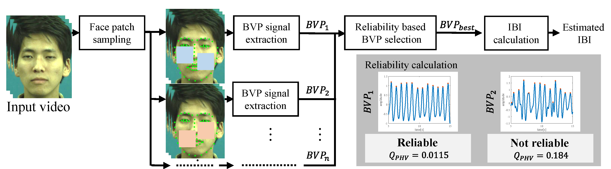

# Inter-beat Interval Estimation Code
We provide a code for the video-based IBI estiamation, which is presented in our EMBC2019 paper entitled "Inter-Beat Interval Estimation from Facial Video Based on Reliability of BVP Signals" <a href="http://www.ok.sc.e.titech.ac.jp/res/VitalSensing/remoteIBI/index.html" target="_blank">[Project Page]</a></b>.
## Overview
This code estimates a pesrson's cardiac information such as inter-beat interval (IBI) and average heart rate (HR) from a facial movie. The flow of the method is following.  
 
## Quick Start

1. Download our repository  
 ` git close https://github.com/ymonno/RemotePPG.git /path/to/direc `  
 *If you download our code, it shall be deemed to have accepted our <a href = "http://www.ok.sc.e.titech.ac.jp/res/VitalSensing/remoteIBI/EULA_EMBC2019.pdf">"End User License Agreement"</a> for the use of a sample facial video to run the demo code.
2. Run the following Matlab commands to download <a href = "https://github.com/YuvalNirkin/find_face_landmarks"> 'find_face_landmarks'</a> and <a href="https://research.ics.aalto.fi/ica/fastica/code/dlcode.shtml">'FastICA'</a>  
` cd  /path/to/direc `  
` setIBIestimation() `  

3. Decompress 'shape_predictor_68_face_landmarks.dat.bz2' 
*We checked that our codes work on matlab2016b. 
*You can also try to use other landmark detection algorithms based on 68 landmarks.
## Main Functions

### __- demo.m__  
You can instantly  run our whole code and display a comparison between IBIs from contact PPG and imaging PPG (our method) visually.

### __- demo_evaluate_TokyoTechDataset.m__
This code evaluates estimated IBI with TokyoTech Remote PPG Dataset.

#### Setup
Please put Tokyo Tech Remote PPG Dataset at /TokyoTechDataset.
  
###  __- getCandidateSignals.m__
Estimate candidate BVP signals with a random patch-based ICA method. In default, we use the green channel signals averaged within  two different patches on the face as ths inputs of ICA. 
We have referred 'Robust Heart Rate Measurement from Video Using Select Random Patches', in ICCV2015 by A. Lam and Y. Kuno to implement the code.

#### Input
- videoFileName: path to the movie
- isDisplayFacialLandmark: If you want to see detected landmarks at the first frame, please set to '1'. If you don't, please set to '0'.
- startTime: start time of the video [sec]
- endTime: end time of the video [sec]
#### Output 
- bvpCandidates: BVP candidates 
- frameRate: framerate of the movie
- time: timestamp of BVP  [sec]  
  
### __- selectReliableSignals.m__   
Select the most reliable BVP for IBI estimation with each metric (QCR, QSNR, and QPHV)   
#### Input 
- bvpCandidates: BVP candidates 
- frameRate: framerate of the movie
#### Output 
- Q_CR, Q_SNR and Q_PHV: selected signals with each metric
xx.MetricValue: the value of the metric  
xx.Signal: selected BVP with the metric  
xx.IBI: IBI which is directly calculated with xx.Signal  
xx.IBI_removedOutlier: IBI after applying outlier removal to xx.IBI  
xx.AverageHR: average heart rate derived by 60/mean(xx.IBI_removedOutlier)  

## Sub Functions

### __- getIBI.m__
Get IBI and its timestamp from peak timestamp.
#### Input
- locs: timestamps of peaks [sec]
#### Output
- IBItable:  
IBItable(1,:): timestamp of IBI [sec]  
IBItable(2,:): IBI [sec]
### __- removeOutIBImedian.m__
Remove outlier of IBI
#### Input
- IBItable:  
IBItable(1,:): timestamp of IBI [sec]  
IBItable(2,:): IBI [sec]  
- medianPar:   
If $|IBI_{t_n} - IBI_{median}| > IBI_{median} \times medianPar$ is satisfied, $IBI_{t_n}$ is removed as an outlier.
- frames2Use:  
frames2Use is $ 1\times2$ vector. IBI whoes timestamp satisfy $ frames2Use(1) < IBI_{timeStamp} < frames2Use(end)$ could be removed.
#### Output
- outPut_IBItable: the pure result of outlier removal
- IBItable_for_RMSSD: the result of outlier removal for RMSSD estimation 
### __- getRMSSD.m__
Get RMSSD of IBI.
#### Input
- IBItable(IBItable_for_RMSSD)
#### Output
- RMSSD: Root Mean Squared Successive Difference for IBI
### __- signal2Metric_and_IBI__
Get each reliaibilty metric score, IBI, and RMSSD from a BVP signal.
#### Input
- signal: BVP signal (contact PPG or imaging PPG)
- Fs: sampling rate of the signal [Hz]
- time: timestamp of the signal [sec]
#### Output
- Q_CR, Q_SNR, Q_PHV, IBI, IBI_removedOut, and RMSSD

### __- getADofIBI.m__
Evaluate IBI.

#### Input
- cPPGFileName: matfile name which contains contact PPG sensor data (full path or relative path)
- selectedSignal: Q_CR, Q_SNR, or Q_PHV 

#### Output
- ADofIBI: absolute difference between estimated and reference IBIs

### __- successRatio.m__
Count the number of components in the dataMatrix whose error is less than a thresthold.
#### Input 
- dataMatrics: target data matrics
- x_Vector: error threshold

#### Output
- successRatioVector: successRatioVector(1,x)=count(dataMatrics < x_Vector(1,x))/count(dataMatrix);

## Dataset 

 Please refer to the <a href = "http://www.ok.sc.e.titech.ac.jp/res/VitalSensing/remoteIBI/index.html">[Project Page]</a> 
 to download our newly constructed facial video dataset for IBI estimation.

## Citation
- <b>Inter-Beat Interval Estimation from Facial Video Based on Reliability of BVP Signals <a href="http://www.ok.sc.e.titech.ac.jp/res/VitalSensing/remoteIBI/EMBC2019.pdf" target="_blank">[pdf]</a></b> 
  Yuichiro Maki, Yusuke Monno, Kazunori Yoshizaki, Masayuki Tanaka, Masatoshi Okutomi 
     International Conference of the IEEE Engineering in Medicine and Biology Society (EMBC), 2019.
